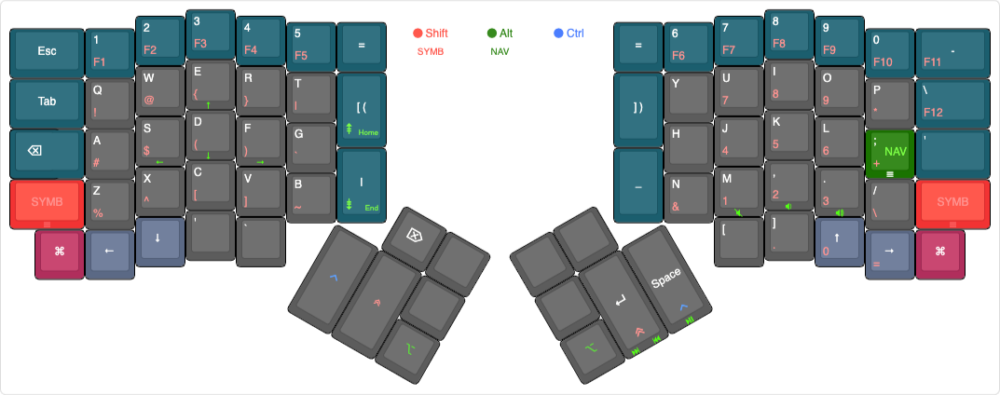

# Danielfm's ErgoDox Layout

This is the [QMK](https://github.com/qmk/qmk_firmware)-based layout I'm
currently using for [ErgoDox EZ](https://ergodox-ez.com), which was
heavily customized to improve comfort while using Emacs and other
applications that rely heavily on modifier keys, such as `Ctrl` and `Alt`.

I'm still not quite finished, so expect more fundamental changes to this layout
as I gather more information about my current usage.

<a href="http://www.keyboard-layout-editor.com/#/gists/ebf52ba3338c94f3698851e9244b6b05">
  
</a>

## Layers

### Base Layer

It's basically a QUERTY layout with some changes designed to eliminate the
load on the pinky fingers for hitting modifier keys, resulting in reduced
tension while typing a large sequence of modified keys, which is somewhat
common in Emacs.

Some of the changes that is worth mentioning in more details:

- To avoid having to `Shift` keys frequently, I enabled the QMK
  [Auto Shift](https://docs.qmk.fm/#/feature_auto_shift) feature for symbols
  and numbers. I did not enable it for alphanumeric keys since I like to be able
  to press repeated letters just by holding the key.
- `Shift`, `Ctrl` and `Alt` modifiers are mapped to the three LED lights at the
  top of the board. These keys also act as
  [one-shot modifiers](https://docs.qmk.fm/#/feature_advanced_keycodes?id=one-shot-keys),
  and their state is also reflected in the LEDs: the light intensity is low when
  the keys are in one-shot state, or high when locked (tap the modifiers 3 times
  to lock).
- As I spend most of the time typing inside Emacs, I moved the `Ctrl` and
  Alt modifiers from the [pinky](http://ergoemacs.org/emacs/emacs_pinky.html)
  to the thumbs. The `Space` key, when held, act as `Ctrl`, making these keys
  easily accessible from both hands, depending on the keystroke being executed;
  for instance, `C-a` and `C-e` use the right-hand Ctrl, while `C-p` and `C-n`
  use the left-hand Ctrl. I also apply this principle for other shortcuts in
  order to minimize the hand gymnastics necessary for common key combinations.
- The `Shift` key is also mirrored in both sides of the board. On the right
  side, it can be activated by long-pressing the `Enter` key. This makes it easy
  on the muscle memory when typing sequences of shifted characters with the hand
  opposite to where the character is located, in the same way as the `Ctrl`
  usage explained earlier.
- Another highly used key, `Command`, was moved to the bottom left and right
  keys of the board, which might seem counterintuitive due to those keys being
  too far to rich, but the idea is to press those keys with my palms, instead of
  using my fingers.
- Since I write software in bash and C-like languages in my daily job, I need
  easy access to keys such as brackets, curly braces and parens (the two inner
  keys at the center-top, tap once for `[` and `]`, twice for `(` and `)`), as
  well as pipes and underscores (the two inner keys at the center-bottom).

### Symbols Layer

This layer is mostly the same as the default ErgoDox EZ.

### Media and Navigation Layer

This layer contains keys for media control and navigation. The most unusual
thing here is the use of tap dance for the `Page Up`/`Page Down` and
`Home`/`End` buttons in the inner keys for the left hand board: tap once for
`Page Up`/`Page Down`, and twice for `Home`/`End`.

## Building

To build it, you will need the [QMK](https://github.com/qmk/qmk_firmware)
firmware checked out, and this repo either checked out to something like
`layouts/community/ergodox/danielfm`, or symlinked there.

One way to achieve that is this:

```
$ git clone https://github.com/qmk/qmk_firmware.git
$ cd qmk_firmware
$ git clone https://github.com/danielfm/ergodox-layout.git \
            layouts/community/ergodox/danielfm
$ make ergodox_ez:danielfm
```

## License

Copyright (C) Daniel Fernandes Martins

Distributed under the New BSD License. See COPYING for further details.
